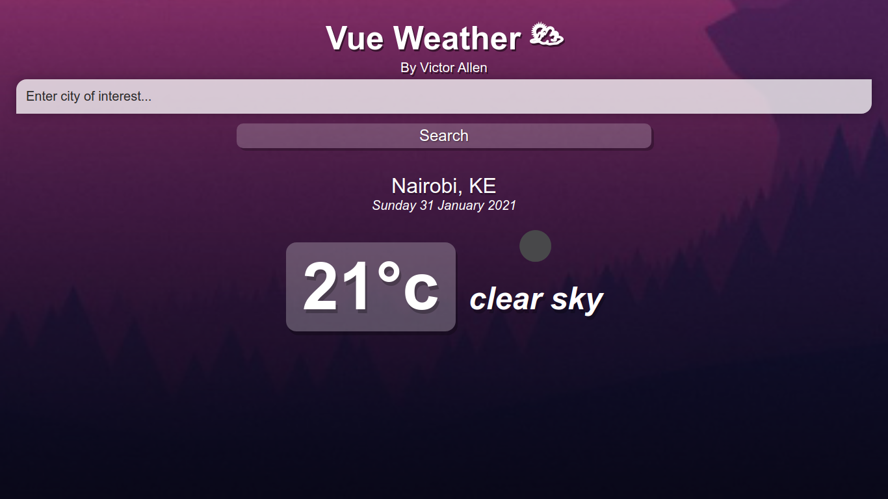

# Vue-Weather ⛅

[](https://app.netlify.com/sites/vue-getweather/deploys)

Vue Weather is a Vue 3 App that utilizes the OpenWeather API to retrieve weather data from various cities in the world.



## Project setup

These instructions will get you a copy of the project up and running on your local machine for development and testing purposes.

### Prerequisites

What things you need to install the software and how to install them

```
* npm 7.3.0 or latest
* Node.js 15.5.1 or latest
```

### Installing

A step by step series of examples that tell you how to get a development env running

Open Terminal / Command Prompt and type:

```
git clone https://github.com/vamuigua/vue-weather.git
```

Then change your directory to the project you have cloned

```
cd vue-weather
```

### OpenWeather API Key

You need an API Key for the project to work. To get one go to [OpenWeather](https://openweathermap.org/), sign up and head to the [api](https://openweathermap.org/api) section to generate an api.

Put your api key in the data function in the App.vue file

```
api_key: "YOUR_API_KEY"
```

### Install packages using npm

```
npm install
```

### Compiles and hot-reloads for development

```
npm run serve
```

### Compiles and minifies for production

```
npm run build
```

### Customize configuration

See [Configuration Reference](https://cli.vuejs.org/config/).

## Built With

- [Vue 3](https://vuejs.org/)
- [Open Weather Api](https://openweathermap.org/)

## Authors

- **Victor Allen** - [vamuigua](https://github.com/vamuigua) :v:

## License

This project is licensed under the MIT License - see the [LICENSE](LICENSE) file for details

## Acknowledgments

- **Tyler Potts** - [TylerPottsDev](https://github.com/TylerPottsDev)
